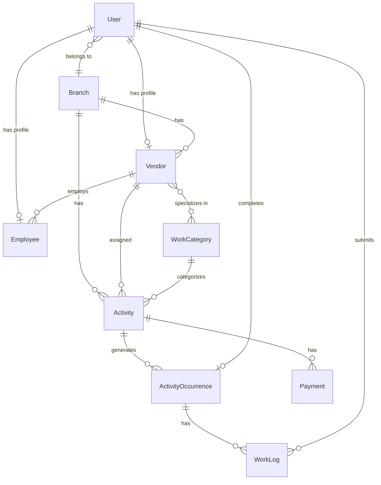

# Vendor Portal — System Architecture

## 1. System Overview

The Vendor Portal is a comprehensive vendor management system built for **K12 Techno Services (Orchids International Schools)**. It enables school administrators to track vendors, monitor work activities, manage payments, and oversee maintenance operations across multiple school branches.

### Users
| Role | Description | Access |
|------|-------------|--------|
| **Admin** | School branch administrator | Full CRUD on all data (branch-scoped), dashboard analytics |
| **Vendor Owner** | Owner of a vendor company | View assigned activities, manage employees, submit work logs |
| **Vendor Employee** | Employee of a vendor | View assigned tasks, submit work logs |

### Components
1. **Django Backend** — REST API server with JWT authentication
2. **React Admin Portal** — Web dashboard for school administrators
3. **Flutter Vendor App** — Android app for vendors and employees

---

## 2. Architecture Diagram

```
┌─────────────────────┐     ┌─────────────────────┐
│   React Admin Portal │     │  Flutter Vendor App  │
│   (Vite + Tailwind)  │     │  (Android - Provider)│
│   Port: 5173         │     │                      │
└──────────┬──────────┘     └──────────┬──────────┘
           │                            │
           │  HTTP/REST + JWT           │  HTTP/REST + JWT
           │                            │
           ▼                            ▼
┌─────────────────────────────────────────────────┐
│              Django REST API Server              │
│              Port: 8000                          │
│                                                  │
│  ┌──────────┐ ┌──────────┐ ┌──────────────────┐ │
│  │ Accounts │ │ Vendors  │ │   Activities     │ │
│  │ (Auth)   │ │ (Branch) │ │   (Occurrences)  │ │
│  └──────────┘ └──────────┘ └──────────────────┘ │
│  ┌──────────┐ ┌──────────┐                       │
│  │Categories│ │ Payments │                       │
│  └──────────┘ └──────────┘                       │
│                                                  │
│  ┌──────────────────┐  ┌──────────────────────┐  │
│  │   SQLite DB       │  │   Media Files        │  │
│  │   (db.sqlite3)    │  │   (photos/uploads)   │  │
│  └──────────────────┘  └──────────────────────┘  │
└─────────────────────────────────────────────────┘
```

---

## 3. Tech Stack

### Backend
| Technology | Purpose |
|-----------|---------|
| Python 3.x | Runtime |
| Django 5.x | Web framework |
| Django REST Framework | API layer |
| djangorestframework-simplejwt | JWT authentication |
| django-cors-headers | Cross-origin requests |
| Pillow | Image processing (photo uploads) |
| SQLite | Database (development) |

### Admin Portal
| Technology | Purpose |
|-----------|---------|
| React 18 | UI framework |
| Vite | Build tool & dev server |
| Tailwind CSS v4 | Utility-first styling |
| Recharts | Dashboard charts (Bar, Line, Pie) |
| Axios | HTTP client with interceptors |
| React Router v6 | Client-side routing |

### Vendor App
| Technology | Purpose |
|-----------|---------|
| Flutter 3.x | Cross-platform framework (Android) |
| Provider | State management |
| http | HTTP client |
| image_picker | Camera/gallery photo capture |
| shared_preferences | Local token/user storage |
| intl | Date formatting |

---

## 4. Database Schema

### Entity-Relationship Diagram



### Model Details

#### User (accounts.User) — extends AbstractUser
| Field | Type | Description |
|-------|------|-------------|
| id | AutoField | Primary key |
| username | CharField | Login username (auto-generated for vendors/employees) |
| password | CharField | Hashed password |
| first_name | CharField | First name |
| last_name | CharField | Last name |
| email | EmailField | Email (optional) |
| role | CharField | `admin` / `vendor_owner` / `vendor_employee` |
| branch | FK → Branch | Assigned branch (nullable) |
| phone | CharField(15) | Phone number |
| aadhar_number | CharField(12) | Aadhar ID number |
| photo | ImageField | Profile photo |

#### Branch (vendors.Branch)
| Field | Type | Description |
|-------|------|-------------|
| id | AutoField | Primary key |
| name | CharField(200) | Branch name (e.g., "Orchids HSR Layout") |
| address | TextField | Full address |
| city | CharField(100) | City name |
| created_at | DateTimeField | Auto-set on creation |

#### Vendor (vendors.Vendor)
| Field | Type | Description |
|-------|------|-------------|
| id | AutoField | Primary key |
| user | OneToOne → User | Linked user account (role=vendor_owner) |
| branch | FK → Branch | Assigned branch |
| company_name | CharField(200) | Vendor company name |
| categories | M2M → WorkCategory | Work specializations |
| created_at | DateTimeField | Auto-set on creation |

#### Employee (vendors.Employee)
| Field | Type | Description |
|-------|------|-------------|
| id | AutoField | Primary key |
| user | OneToOne → User | Linked user account (role=vendor_employee) |
| vendor_owner | FK → Vendor | Parent vendor company |
| created_at | DateTimeField | Auto-set on creation |

#### WorkCategory (categories.WorkCategory)
| Field | Type | Description |
|-------|------|-------------|
| id | AutoField | Primary key |
| name | CharField(100) | Category name (unique) |
| description | TextField | Category description |
| created_at | DateTimeField | Auto-set on creation |

#### Activity (activities.Activity)
| Field | Type | Description |
|-------|------|-------------|
| id | AutoField | Primary key |
| branch | FK → Branch | Which branch |
| vendor | FK → Vendor | Assigned vendor |
| category | FK → WorkCategory | Work type (nullable) |
| title | CharField(200) | Activity title |
| description | TextField | Detailed description |
| activity_type | CharField | `one_time` / `long_term` / `recurring` |
| start_date | DateField | When work starts |
| end_date | DateField | When work ends (nullable for one_time) |
| recurrence_interval_days | IntegerField | Days between recurrences (nullable) |
| expected_cost | DecimalField(10,2) | Budget for this activity |
| payment_type | CharField | `hourly` / `daily` / `contract` |
| status | CharField | `pending` / `in_progress` / `completed` / `cancelled` |
| created_at | DateTimeField | Auto-set on creation |
| **is_overdue** | **Property** | **Computed: end_date < today AND status != completed** |

#### ActivityOccurrence (activities.ActivityOccurrence)
| Field | Type | Description |
|-------|------|-------------|
| id | AutoField | Primary key |
| activity | FK → Activity | Parent activity |
| scheduled_date | DateField | When this occurrence is scheduled |
| status | CharField | `pending` / `completed` / `missed` |
| completed_by | FK → User | Who completed it (nullable) |
| completed_at | DateTimeField | When completed (nullable) |

#### WorkLog (activities.WorkLog)
| Field | Type | Description |
|-------|------|-------------|
| id | AutoField | Primary key |
| occurrence | FK → ActivityOccurrence | Which occurrence |
| user | FK → User | Who submitted |
| before_photo | ImageField | Photo before work |
| after_photo | ImageField | Photo after work |
| description | TextField | Work description |
| created_at | DateTimeField | Auto-set on creation |

#### Payment (payments.Payment)
| Field | Type | Description |
|-------|------|-------------|
| id | AutoField | Primary key |
| activity | FK → Activity | Related activity |
| expected_amount | DecimalField(10,2) | Amount expected |
| actual_amount_paid | DecimalField(10,2) | Amount actually paid |
| payment_status | CharField | `pending` / `partial` / `completed` |
| payment_date | DateField | When paid (nullable) |
| notes | TextField | Payment notes |
| created_at | DateTimeField | Auto-set on creation |

---

## 5. API Endpoints

### Authentication
| Method | Endpoint | Description | Auth |
|--------|----------|-------------|------|
| POST | `/api/auth/login/` | Login → JWT tokens + user info | Public |
| POST | `/api/auth/token/refresh/` | Refresh access token | Public (with refresh token) |
| GET | `/api/auth/profile/` | Get current user profile | Required |

### Branches
| Method | Endpoint | Description | Auth |
|--------|----------|-------------|------|
| GET | `/api/branches/` | List branches | Admin |
| POST | `/api/branches/` | Create branch | Admin |
| GET | `/api/branches/{id}/` | Get branch | Admin |
| PUT | `/api/branches/{id}/` | Update branch | Admin |
| DELETE | `/api/branches/{id}/` | Delete branch | Admin |

### Work Categories
| Method | Endpoint | Description | Auth |
|--------|----------|-------------|------|
| GET | `/api/categories/` | List categories | Authenticated |
| POST | `/api/categories/` | Create category | Admin |
| PUT | `/api/categories/{id}/` | Update category | Admin |
| DELETE | `/api/categories/{id}/` | Delete category | Admin |

### Vendors
| Method | Endpoint | Description | Auth |
|--------|----------|-------------|------|
| GET | `/api/vendors/` | List vendors (branch-scoped for admin) | Authenticated |
| POST | `/api/vendors/` | Register vendor → returns credentials | Admin |
| GET | `/api/vendors/{id}/` | Get vendor details | Authenticated |
| PUT | `/api/vendors/{id}/` | Update vendor | Admin |
| DELETE | `/api/vendors/{id}/` | Delete vendor | Admin |
| GET | `/api/vendors/by-category/?cat={id}` | Filter vendors by category | Authenticated |

### Employees
| Method | Endpoint | Description | Auth |
|--------|----------|-------------|------|
| GET | `/api/employees/` | List employees | Authenticated |
| POST | `/api/employees/` | Register employee → returns credentials | Admin / Vendor Owner |
| GET | `/api/employees/{id}/` | Get employee details | Authenticated |
| DELETE | `/api/employees/{id}/` | Delete employee | Admin / Vendor Owner |

### Activities
| Method | Endpoint | Description | Auth |
|--------|----------|-------------|------|
| GET | `/api/activities/` | List activities (branch-scoped) | Authenticated |
| POST | `/api/activities/` | Create activity → generates occurrences | Admin |
| GET | `/api/activities/{id}/` | Get activity details | Authenticated |
| PUT | `/api/activities/{id}/` | Update activity | Admin |
| DELETE | `/api/activities/{id}/` | Delete activity | Admin |
| GET | `/api/activities/{id}/occurrences/` | List occurrences for activity | Authenticated |

### Occurrences
| Method | Endpoint | Description | Auth |
|--------|----------|-------------|------|
| GET | `/api/occurrences/` | List occurrences | Authenticated |
| GET | `/api/occurrences/today/` | Today's tasks (vendor-scoped) | Authenticated |
| PATCH | `/api/occurrences/{id}/` | Update status (complete/miss) | Authenticated |

### Work Logs
| Method | Endpoint | Description | Auth |
|--------|----------|-------------|------|
| GET | `/api/work-logs/` | List work logs | Authenticated |
| POST | `/api/work-logs/` | Submit work log with photos (multipart) | Authenticated |

### Payments
| Method | Endpoint | Description | Auth |
|--------|----------|-------------|------|
| GET | `/api/payments/` | List payments (branch-scoped) | Authenticated |
| POST | `/api/payments/` | Record payment | Admin |
| PUT | `/api/payments/{id}/` | Update payment | Admin |
| DELETE | `/api/payments/{id}/` | Delete payment | Admin |

### Dashboard
| Method | Endpoint | Description | Auth |
|--------|----------|-------------|------|
| GET | `/api/dashboard/stats/` | Aggregate statistics | Admin |
| GET | `/api/dashboard/spending-trends/` | Monthly spending (6 months) | Admin |
| GET | `/api/dashboard/completion-rates/` | Monthly completion rates (6 months) | Admin |

---

## 6. Authentication & Authorization

### JWT Token Flow
```
1. Client sends POST /api/auth/login/ with {username, password}
2. Server validates credentials
3. Server returns {access_token (1 day), refresh_token (7 days), user_info}
4. Client stores tokens (localStorage / SharedPreferences)
5. All subsequent requests include: Authorization: Bearer <access_token>
6. On 401 response: client sends POST /api/auth/token/refresh/ with refresh_token
7. Server returns new access_token
8. If refresh fails: client redirects to login
```

### Role-Based Permissions
```
Admin:
  - Full CRUD on all resources
  - Data scoped to their branch
  - Dashboard access
  - Can register vendors and employees

Vendor Owner:
  - Read their own activities and occurrences
  - Create/manage their employees
  - Submit work logs
  - View today's tasks

Vendor Employee:
  - View assigned tasks (via vendor owner)
  - Submit work logs
  - View today's tasks
```

### Branch Scoping
All admin queries automatically filter by `request.user.branch`:
- Vendors list shows only vendors in admin's branch
- Activities show only activities in admin's branch
- Payments filtered by activity's branch
- Dashboard stats are branch-specific

### Auto-Credential Generation
When registering a vendor or employee:
1. System generates username from phone number (e.g., `vendor_9876543210`)
2. System generates random 8-character alphanumeric password
3. User account created with hashed password
4. Plain-text credentials returned **once** in the API response
5. Credentials are never retrievable again (password is hashed)

---

## 7. Key Business Logic

### Activity Occurrence Generation
When an activity is created, the system auto-generates `ActivityOccurrence` records:

```
one_time:
  → 1 occurrence on start_date

long_term:
  → 1 occurrence per day from start_date to end_date
  → Example: 30-day contract = 30 occurrences

recurring:
  → 1 occurrence every N days from start_date to end_date
  → N = recurrence_interval_days
  → Example: every 7 days for 3 months ≈ 13 occurrences
```

### Overdue Detection
Computed as a property on each read (not stored in DB):
```python
@property
def is_overdue(self):
    if self.end_date and self.status != 'completed':
        return self.end_date < timezone.now().date()
    return False
```

### Dashboard Statistics
Aggregated on-demand from the database:
- **Total counts**: vendors, activities, employees
- **Payment sums**: SUM of pending vs completed payments
- **Overdue count**: activities where is_overdue == True
- **Status breakdown**: COUNT grouped by activity status
- **Spending trends**: Monthly SUM of actual_amount_paid for last 6 months
- **Completion rates**: Monthly (completed occurrences / total occurrences) × 100

---

## 8. Frontend Architecture

### React Admin Portal

```
App.jsx
├── AuthProvider (Context)
│   ├── Login Page
│   └── ProtectedRoute
│       └── Layout (Sidebar + TopBar + Outlet)
│           ├── Dashboard (stats + charts)
│           ├── Vendors (list + create modal)
│           │   └── VendorDetail (info + employees + activities)
│           ├── Activities (list + create modal)
│           │   └── ActivityDetail (info + occurrences + work logs)
│           ├── Payments (summary + list + record modal)
│           └── Categories (CRUD list)
```

**State Management**: React Context for auth, local state (useState) for page data
**API Layer**: Axios instance with JWT interceptors (auto-attach token, auto-refresh on 401)
**Styling**: Tailwind CSS utility classes throughout

### Flutter Vendor App

```
main.dart
├── MultiProvider
│   ├── AuthProvider (ChangeNotifier)
│   └── ActivityProvider (ChangeNotifier)
│
├── LoginScreen
├── OwnerDashboard
│   ├── Today's Tasks (TaskCard list)
│   ├── EmployeeListScreen
│   │   └── AddEmployeeScreen
│   └── OccurrenceDetailScreen
│       └── WorkLogScreen (photo upload)
└── EmployeeDashboard
    ├── Today's Tasks
    └── OccurrenceDetailScreen
        └── WorkLogScreen
```

**State Management**: Provider + ChangeNotifier
**Storage**: SharedPreferences for JWT tokens and user data
**Photos**: image_picker (camera/gallery) → multipart upload

---

## 9. Data Flow Diagrams

### Vendor Registration Flow
```
Admin (React Portal)
  │
  ├─ Fills vendor form (company, owner name, phone, categories)
  │
  ├─ POST /api/vendors/
  │
  ▼
Django Backend
  │
  ├─ Creates User (role=vendor_owner, username=vendor_<phone>, random password)
  ├─ Creates Vendor (linked to User, assigned to admin's branch)
  ├─ Links categories (M2M)
  │
  ├─ Returns: vendor data + {username, password} ← SHOWN ONCE
  │
  ▼
Admin sees credentials modal → shares with vendor
```

### Activity Creation → Occurrence Generation
```
Admin creates activity
  │
  ├─ POST /api/activities/ {title, vendor, category, type, dates, cost}
  │
  ▼
Backend perform_create()
  │
  ├─ Saves Activity record
  │
  ├─ Generates occurrences based on type:
  │   ├─ one_time → [start_date]
  │   ├─ long_term → [start_date, start_date+1, ..., end_date]
  │   └─ recurring → [start_date, start_date+N, start_date+2N, ..., end_date]
  │
  ├─ Creates ActivityOccurrence for each date
  │
  ▼
Occurrences appear in vendor's "Today's Tasks" on scheduled dates
```

### Work Log Submission
```
Vendor/Employee (Flutter App)
  │
  ├─ Opens today's tasks → taps occurrence
  │
  ├─ Takes "Before" photo (camera/gallery)
  ├─ Does the actual work
  ├─ Takes "After" photo
  ├─ Writes description
  │
  ├─ POST /api/work-logs/ (multipart form data)
  │   ├─ occurrence_id
  │   ├─ before_photo (file)
  │   ├─ after_photo (file)
  │   └─ description
  │
  ▼
Backend
  │
  ├─ Saves photos to media/work_logs/
  ├─ Creates WorkLog record
  ├─ Updates occurrence status → completed
  │
  ▼
Admin can view work logs with photos in Activity Detail page
```

### Payment Recording
```
Admin (React Portal)
  │
  ├─ Opens Payments page → "Record Payment"
  ├─ Selects Activity (auto-fills expected amount)
  ├─ Enters actual amount, status, date, notes
  │
  ├─ POST /api/payments/
  │
  ▼
Backend saves Payment record
  │
  ▼
Dashboard updates:
  ├─ Spending trends chart
  ├─ Pending payments count
  └─ Payment summary cards
```

---

## 10. Seed Data

The `python manage.py seed_data` command creates test data:

### Branches (3)
| Name | City |
|------|------|
| Orchids HSR Layout | Bangalore |
| Orchids Whitefield | Bangalore |
| Orchids Sarjapur | Bangalore |

### Work Categories (6)
Plumbing, Electrical, Cleaning, Painting, Carpentry, Gardening

### Users
| Type | Count | Username Pattern | Default Password |
|------|-------|-----------------|-----------------|
| Admin | 3 (one per branch) | admin_hsr, admin_whitefield, admin_sarjapur | admin123 |
| Vendor Owner | 6 (two per branch) | vendor_<phone> | random 8-char |
| Employee | 12 (two per vendor) | emp_<phone> | random 8-char |

### Activities (15)
- Mix of one_time, long_term, recurring types
- Mix of pending, in_progress, completed statuses
- Some with past end dates (overdue)
- Costs ranging ₹5,000 - ₹50,000
- Auto-generated occurrences

### Work Logs (30)
- Distributed across completed occurrences
- Descriptions only (no actual photo files in seed data)

### Payments (15)
- Mix of pending, partial, completed statuses
- Various amounts matching activity costs

---

## 11. Deployment & Development Setup

### Prerequisites
- Python 3.10+
- Node.js 18+
- Flutter 3.x with Android SDK
- Android emulator (for Flutter app)

### Running the Backend
```bash
cd backend
pip install django djangorestframework djangorestframework-simplejwt django-cors-headers Pillow
python manage.py migrate
python manage.py seed_data    # Load test data
python manage.py runserver    # http://localhost:8000
```

### Running the Admin Portal
```bash
cd admin-portal
npm install
npm run dev                   # http://localhost:5173
```

### Running the Flutter App
```bash
cd vendor-app
flutter pub get
flutter run                   # Launches on connected Android device/emulator
```

### Environment Notes
- Backend API: `http://localhost:8000/api/`
- Admin Portal: `http://localhost:5173/`
- Flutter App connects to: `http://10.0.2.2:8000/api/` (Android emulator → host localhost)
- Media files served from: `http://localhost:8000/media/`
- CORS is open in development (`CORS_ALLOW_ALL_ORIGINS = True`)
- SQLite database file: `backend/db.sqlite3`

### Production Considerations
- Replace SQLite with PostgreSQL
- Configure proper CORS allowed origins
- Set DEBUG = False
- Use environment variables for SECRET_KEY
- Serve media files via nginx/S3
- Add HTTPS/TLS
- Set proper JWT token lifetimes
